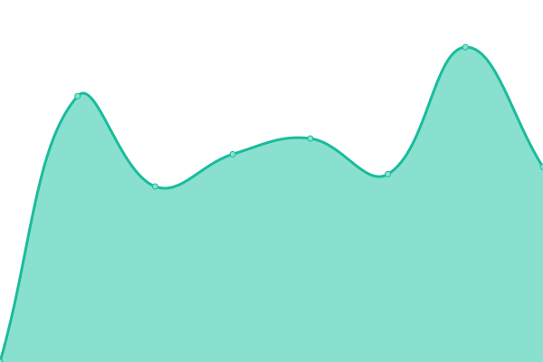

# [📈 Live Status](https://grzchr15.github.io/uptime): <!--live status--> **🟧 Partial outage**

This repository contains the open-source uptime monitor and status page for [grzchr15](https://bretterhofer.at), powered by [Upptime](https://github.com/upptime/upptime).

With [Upptime](https://upptime.js.org), you can get your own unlimited and free uptime monitor and status page, powered entirely by a GitHub repository. We use [Issues](https://github.com/grzchr15/uptime/issues) as incident reports, [Actions](https://github.com/grzchr15/uptime/actions) as uptime monitors, and [Pages](https://grzchr15.github.io/uptime) for the status page.

<!--start: status pages-->
<!-- This summary is generated by Upptime (https://github.com/upptime/upptime) -->
<!-- Do not edit this manually, your changes will be overwritten -->
<!-- prettier-ignore -->
| URL | Status | History | Response Time | Uptime |
| --- | ------ | ------- | ------------- | ------ |
|  [Google](https://www.google.com) | 🟩 Up | [google.yml](https://github.com/grzchr15/uptime/commits/HEAD/history/google.yml) | 

 112ms
     
 | 

<a href="https://grzchr15.github.io/uptime/history/google">100.00%</a>
    

|  [Wikipedia](https://en.wikipedia.org) | 🟩 Up | [wikipedia.yml](https://github.com/grzchr15/uptime/commits/HEAD/history/wikipedia.yml) | 

 320ms
     
 | 

<a href="https://grzchr15.github.io/uptime/history/wikipedia">100.00%</a>
    

|  [bretterhofer.at](https://bretterhofer.at) | 🟩 Up | [bretterhofer-at.yml](https://github.com/grzchr15/uptime/commits/HEAD/history/bretterhofer-at.yml) | 

 1232ms
     
 | 

<a href="https://grzchr15.github.io/uptime/history/bretterhofer-at">100.00%</a>
    

|  [h4.bretterhofer.at](https://h4.bretterhofer.at/toggle.php) | 🟥 Down | [h4-bretterhofer-at.yml](https://github.com/grzchr15/uptime/commits/HEAD/history/h4-bretterhofer-at.yml) | 

 605ms
     
 | 

<a href="https://grzchr15.github.io/uptime/history/h4-bretterhofer-at">96.82%</a>
    

|  [h6.bretterhofer.at](https://h6.bretterhofer.at) | 🟥 Down | [h6-bretterhofer-at.yml](https://github.com/grzchr15/uptime/commits/HEAD/history/h6-bretterhofer-at.yml) | 

 0ms
     
 | 

<a href="https://grzchr15.github.io/uptime/history/h6-bretterhofer-at">0.00%</a>
    

|  [volkstanz.st](https://volkstanz.st) | 🟩 Up | [volkstanz-st.yml](https://github.com/grzchr15/uptime/commits/HEAD/history/volkstanz-st.yml) | 

 1185ms
     
 | 

<a href="https://grzchr15.github.io/uptime/history/volkstanz-st">100.00%</a>
    

|  [volkstanzwannwo.at](https://volkstanzwannwo.at) | 🟩 Up | [volkstanzwannwo-at.yml](https://github.com/grzchr15/uptime/commits/HEAD/history/volkstanzwannwo-at.yml) | 

 2558ms
     
 | 

<a href="https://grzchr15.github.io/uptime/history/volkstanzwannwo-at">99.73%</a>
    

|  [kinderundjugendtanz.at](https://kinderundjugendtanz.at) | 🟩 Up | [kinderundjugendtanz-at.yml](https://github.com/grzchr15/uptime/commits/HEAD/history/kinderundjugendtanz-at.yml) | 

 1892ms
     
 | 

<a href="https://grzchr15.github.io/uptime/history/kinderundjugendtanz-at">100.00%</a>
    

|  [andritz.me](https://andritz.me) | 🟥 Down | [andritz-me.yml](https://github.com/grzchr15/uptime/commits/HEAD/history/andritz-me.yml) | 

 0ms
     
 | 

<a href="https://grzchr15.github.io/uptime/history/andritz-me">0.00%</a>
    

<!--end: status pages-->

[**Visit our status website →**](https://grzchr15.github.io/uptime)

## 📄 License

- Powered by: [Upptime](https://github.com/upptime/upptime)
- Code: [MIT](./LICENSE) © [grzchr15](https://bretterhofer.at)
- Data in the `./history` directory: [Open Database License](https://opendatacommons.org/licenses/odbl/1-0/)
